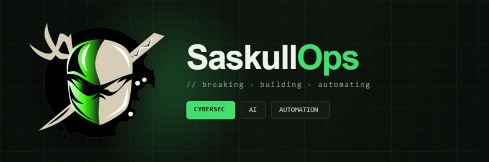

<p align="center">
  
</p>

<h1 align="center">SaskullOps</h1>

<p align="center">
  <strong><code>// breaking · building · automating</code></strong>
</p>

<p align="center">
  <a href="https://saskullops.github.io">🌐 saskullops.github.io</a>
</p>

<br>

## 🎯 ¿Qué es SaskullOps?

Un **laboratorio abierto** donde se documenta cómo utilizar **IA, automatización y buenas prácticas IT** para mejorar la **ciberseguridad** y la **productividad profesional**.

No es un medio de noticias. Es un espacio de **construcción pública** donde comparto lo que funciona (y lo que no) mientras construyo mi infraestructura, mis automatizaciones y mi aprendizaje en seguridad.

<br>

## 📂 Contenido

| Categoría | Tags |
|---|---|
| **Homelabs & Automatización** | `#Docker` `#n8n` `#RaspberryPi` `#HermesAgent` |
| **Ciberseguridad Práctica** | `#hardening` `#SOC` `#monitorización` `#CTF` |
| **IA para Profesionales IT** | `#LLMs` `#OpenRouter` `#agentes` `#automatización` |
| **Build in Public** | `#costes` `#decisiones` `#aprendizajes` |

<br>

## 🚀 Stack

```
Homelab      →  Raspberry Pi 4 + Docker
Automatización → n8n + Hermes Agent
Blog         → Jekyll + Chirpy Theme · GitHub Pages
Modelos      → Ollama (local) · OpenRouter (cloud)
Newsletter   → Próximamente
```

<br>

## 📬 Contacto

- **Blog:** [saskullops.github.io](https://saskullops.github.io)
- **GitHub:** [@SaskullOps](https://github.com/SaskullOps)
- **Email:** a.guardiola.m@gmail.com

<br>

---

<p align="center">
  <strong>Hecho con ☕, 🖥️ y mucha paciencia</strong>
  <br>
  <sub>© 2025 SaskullOps · Construido en público</sub>
</p>